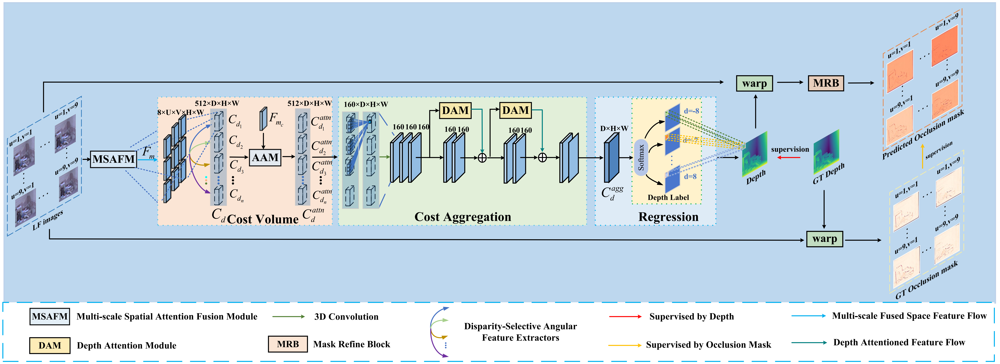
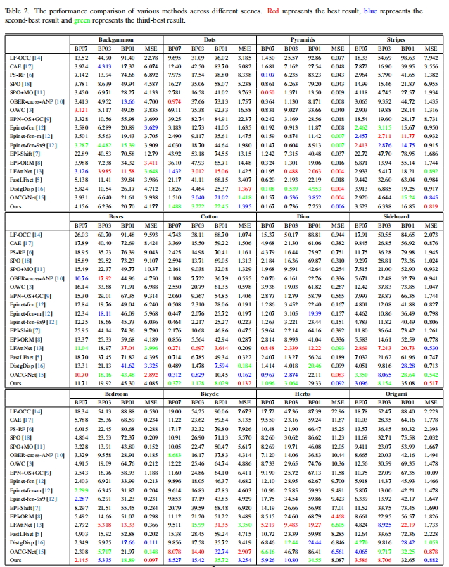
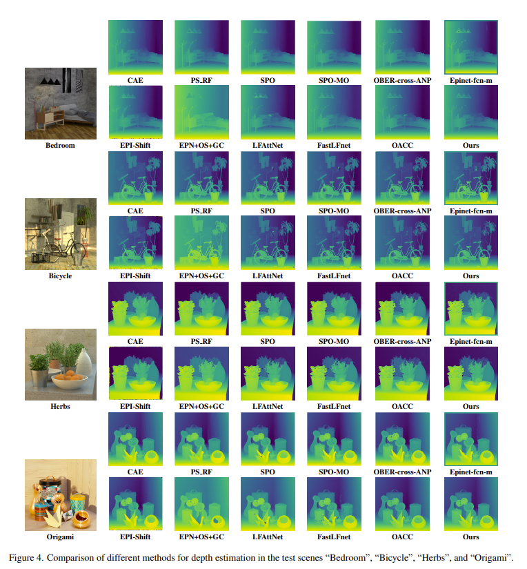

## OADLNet

***PyTorch implementation of our paper "Occlusion Mask Supervision Guided Multi-Scale Fusion Network for Light Field
Depth Estimation".***<br>


## Preparation:
### Requirement:
* PyTorch 2.3.0, torchvision 0.18.1. The code is tested with python=3.10, cuda=12.2.
* A single GPU with cuda memory 24 GB is required to reproduce the inference time reported in our paper.

### Datasets:
* We used the HCI 4D LF benchmark for training. Subsequently, we used the HCI 4D LF benchmark and The (New) Stanford Light Field Archive for testing. Please refer to the [benchmark website](https://lightfield-analysis.uni-konstanz.de) and [Light Field Archive](http://lightfield.stanford.edu/lfs.html) for details.

### Path structure:
  ```
  ├──./datasets/
  │    ├── training
  │    │    ├── antinous
  │    │    │    ├── gt_disp_lowres.pfm
  │    │    │    ├── valid_mask.png
  │    │    │    ├── input_Cam000.png
  │    │    │    ├── input_Cam001.png
  │    │    │    ├── ...
  │    │    ├── boardgames
  │    │    ├── ...
  │    ├── validation
  │    │    ├── backgammon
  │    │    │    ├── gt_disp_lowres.pfm
  │    │    │    ├── input_Cam000.png
  │    │    │    ├── input_Cam001.png  
  │    │    │    ├── ...
  │    │    ├── boxes
  │    |    ├── ...
  │    ├── test
  │    │    ├── bedroom
  │    │    │    ├── input_Cam000.png
  │    │    │    ├── input_Cam001.png  
  │    │    │    ├── ...
  │    │    ├── bicycle
  │    |    ├── herbs
  │    |    ├── origami
  ```

## Train:
* Set the hyper-parameters in `parse_args()` if needed. We have provided our default settings in the codes.
* Run `train.py` to perform network training.
* Checkpoint will be saved to `./log/`.

## Test on your own LFs:
* Place the input LFs into `./demo_input`.
* Run `test.py` to perform inference on each test scene.
* The result files (i.e., `scene_name.pfm`) will be saved to `./Results/`.

## Reproduce the scores on the HCI 4D LF benchmark:
* Perform inference on each scene separately to generate `.pfm` result files.
* Download groundtruth disparity images (i.e., `gt_disp_lowres.pfm`) and use the [official evaluation toolkit](https://github.com/lightfield-analysis/evaluation-toolkit) to obtain quantitative results.

## Reproduce the inference time reported in our paper:
* Run `test_inference_time.py` to reproduce the inference time reported in our paper. Note that, the inference need to be performed on a GPU with a cuda memory 24 GB.

## Results:

### Quantitative Results:

### Visual Comparisons:


### Performance on real LFs:

